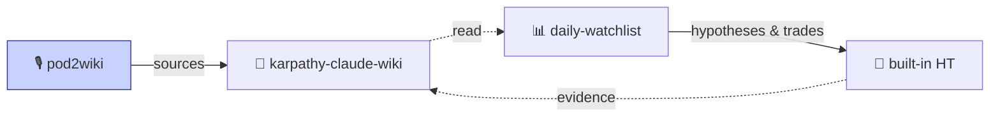

[中文](#中文) | [English](#english)

[](https://github.com/Benboerba620/pod2wiki/releases/latest)
[](https://github.com/Benboerba620/pod2wiki/actions/workflows/podcast-lint.yml)

> 🎙️ **30 秒看懂 / In 30 seconds**：把高质量播客（YouTube/RSS）和长文 RSS 自动转成中文摘要 + 英文原文存档，写进你的个人 LLM 知识库。Whisper 转录 + DeepSeek 翻译，一键 AI 安装。
> Turn high-signal podcasts and long-form RSS into Chinese summaries plus archived English transcripts, written into your personal LLM wiki. Whisper + DeepSeek, one-line AI install.

> 🔗 **零代码 AI 投研三件套** ｜ Zero-code AI investment research toolkit
> **🎙️ pod2wiki 输入** · 🧠 [karpathy-claude-wiki](https://github.com/Benboerba620/karpathy-claude-wiki) 底座 · 📊 [daily-watchlist](https://github.com/Benboerba620/daily-watchlist) 日常 + 内置假设追踪



---

# 中文

pod2wiki 把高质量播客和长文 RSS 自动转成 `karpathy-claude-wiki` 兼容的 `source-summary` 页面。它是 wiki 的信息输入端：订阅源负责发现材料，脚本负责转录/摘要/写入，wiki 负责长期沉淀。

**默认开箱**：AI 投研主题 + 10 个精选高质量来源（Dwarkesh / Lex Fridman / Latent Space / Karpathy / Dylan Patel / Leopold / Doug O'Laughlin / Sam Altman / Jensen Huang / SemiAnalysis）。后续按需自己加频道、博主、假设。

## 推荐：让 AI agent 帮你装

复制下面这句话给 Claude Code、Codex、Cursor 或任何能读写文件的 AI agent：

> 帮我按这个协议安装 pod2wiki：https://github.com/Benboerba620/pod2wiki/blob/main/INSTALL-FOR-AI.md

Agent 会问你两个问题（wiki 路径、用哪家 LLM），然后自动跑一次 dry-run 验证，给你装好 slash command 和 skill。装完后在 Claude Code 里输入 `/pod2wiki` 或者「刷一下播客」就能跑。

## 装完了，怎么改成"我自己的"关注领域？

打开 `config/pod2wiki.config.yaml`，3 个地方决定你看到什么：

### 1. 关注领域 — `theme` + `hypotheses`

`theme` 只是个标签（影响 insight log 文件名）。真正决定"AI 帮你筛什么"的是 `hypotheses` 关键词列表——脚本会用它给摘要做主题归属。

默认是 AI 投资。要换成能源投资就改成：

```yaml
theme: energy-investing

hypotheses:
  H1:
    title: 数据中心电力瓶颈
    keywords: [data center power, grid, transformer, 变压器, 电网]
  H2:
    title: 核电复兴
    keywords: [nuclear, SMR, 核电, uranium, 铀]
  H3:
    title: 天然气作为 AI 过渡能源
    keywords: [natural gas, LNG, gas turbine, peaker]
```

### 2. 核心人物 — `people_searches` / `exec_searches`

这两个字段就是 YouTube 搜索词。脚本拿每条字符串去搜 YouTube，抓最近 N 天的视频。`people_searches` 给研究员/分析师用，`exec_searches` 给 CEO/创始人用——区分只是为了你自己查 config 时一眼看清。

```yaml
people_searches:
  - "Doug O'Laughlin semiconductor interview"
  - "Dylan Patel SemiAnalysis interview"
  - "Leopold Aschenbrenner AI interview"

exec_searches:
  - "Jensen Huang interview"
  - "Sam Altman interview"
```

> 想追谁就照葫芦画瓢加一行。搜索词写得越具体越好（带"interview"、"podcast"等限定词）。

### 3. 优质频道 — `channels` + `blog_feeds`

`channels` 是 YouTube 频道首页 + 可选 RSS（双轨抓取，避免单点失败）。`blog_feeds` 是纯文字博客 RSS。

```yaml
channels:
  - name: Dwarkesh Podcast
    youtube: "https://www.youtube.com/@DwarkeshPatel/videos"
    rss: "https://www.dwarkesh.com/feed"
    keywords: [AI, AGI, compute, scaling]
  - name: Latent Space
    youtube: "https://www.youtube.com/@LatentSpaceTV/videos"
    rss: "https://api.substack.com/feed/podcast/1084089.rss"
    keywords: [LLM, agents, AI engineering]

blog_feeds:
  - name: SemiAnalysis
    url: "https://www.semianalysis.com/feed"
    author: Dylan Patel
```

**怎么挖优质频道？** 两个起点：
- 你已经在听的播客 → 找它的 RSS（多数 Substack/Apple Podcasts/Spotify 的页面底部都有）
- 你常读的研究员/博主 → 翻他的 X / 个人博客，找 RSS 链接（一般在 `/feed`、`/rss` 路径）

> 不知道该追谁？看 `examples/config.ai-investing.yaml` 里默认追的 10 个 AI 信息源（Dwarkesh / Lex Fridman / Latent Space / Karpathy / Dylan Patel / Leopold / Doug O'Laughlin / Sam Altman / Jensen Huang / SemiAnalysis），照葫芦画瓢替换成你领域的对标人物即可。

改完保存，下次跑 `/pod2wiki` 就按你的新配置抓。

默认扫描窗口是最近 7 天，并限制每个 RSS/blog 来源最多处理 3 条：

```yaml
days_lookback: 7
max_items_per_feed: 3
max_videos_per_channel: 5
```

`max_items_per_feed` 是“每个 RSS/blog 来源最多处理几条”，不是全局上限；`max_videos_per_channel` 是 YouTube 每个频道/搜索词先看的候选数量，设成 5 是为了给无字幕、重复或不相关视频留一点缓冲。如果你只想控制整次运行的总处理量，再在命令里加 `--max-items 20` 这类全局安全阀。

> ⚠️ **YouTube 不适合批量历史回填**：YouTube 搜索、字幕接口和 `yt-dlp` 都可能很快触发限流。建议每次只处理少量视频（3-5 条左右）。如果你要整理一个频道的大量历史内容，优先使用播客 RSS；如果没有 RSS，就先把音频/转录保存成本地文件，再用 `--input-file` 导入。遇到 `429` / `TooManyRequests` / rate limit 时，停止本轮 YouTube 抓取，隔一段时间再继续。

## 抓完之后，文件去哪了？

每次 `/pod2wiki` 跑完，会在 wiki 目录下生成两份文件：

- `wiki/sources/{date}-{channel}-{slug}.md` — 中文摘要 + 关键数据 + 引文（喂给 karpathy-claude-wiki 当知识页用）
- `wiki/raw/podcasts/{date}-{channel}-{slug}.md` — **完整英文原文**（Whisper 转录或 RSS 全文）

可选：加 `--translate-full` 还会写 `wiki/translations/` 下的全文中译。

> 🔑 **raw 永远保留**——意味着如果你后续想要全文中译（不只是摘要），不需要重新抓 mp3、不需要重新跑 Whisper、不需要再消耗一次网络流量，**直接拿 raw 文件喂任何 LLM 翻译就行**：
>
> ```bash
> # 示例：把某一集英文 raw 喂给本地 LLM 二次翻译
> cat wiki/raw/podcasts/2026-04-26-dwarkesh-leopold-aschenbrenner.md \
>   | your-llm-cli --prompt "翻译成中文，保留所有数字和公司名"
> ```

## 完整数据流

```text
订阅源 (channels.youtube / channels.rss / blog_feeds / people_searches / exec_searches)
   |
   v  抓最近 N 天（days_lookback，默认 7 天）
mp3 / 视频字幕 / RSS 全文
   |
   v  Whisper transcribe（mp3）或 直接拿（字幕 / RSS 全文）
英文全文  ----->  wiki/raw/podcasts/        (永久归档，二次复用)
   |
   v  DeepSeek V4 Flash 摘要 + 翻译（默认；可换 Kimi/GLM/Qwen/OpenAI）
中文 source-summary  ----->  wiki/sources/  (karpathy-claude-wiki 兼容)
   |
   v  insight log 汇总
output/pod2wiki/{theme}-insights-log.md     (本次扫描的主线整理)
```

> 💡 **关于 Whisper 触发条件**：只在 RSS description 短于 1500 字符（默认 `whisper.auto_threshold`）且有音频链接时才下 mp3 跑 Whisper。Substack 这类自带完整 show notes 的频道（描述往往几万字符）会**跳过** Whisper 直接用 description——更省钱、更准、信息量更大。要强制走 Whisper 加 `--whisper-threshold 999999`；要完全关掉加 `--no-whisper`。

LLM 提供商在 `config/pod2wiki.env` 里切。**默认 DeepSeek V4 Flash**——英→中摘要性价比最高；要换 Kimi / GLM / Qwen / OpenAI，把对应段落取消注释即可（全部 OpenAI 兼容协议）。

## 不包含什么

- 没有 GUI
- 没有内置股票观点
- 没有付费数据源绑定
- 不保证 YouTube 在所有网络环境都可用（有代理设 `PODCAST_PROXY` 环境变量；无代理时 RSS 部分仍可用）

## License

MIT.

---

# English

pod2wiki turns high-signal podcasts and long-form RSS feeds into `source-summary` pages compatible with `karpathy-claude-wiki`. It is the ingestion layer for a markdown-first research wiki.

**Default starter pack**: AI investing theme + 10 curated high-signal sources (Dwarkesh, Lex Fridman, Latent Space, Karpathy, Dylan Patel, Leopold, Doug O'Laughlin, Sam Altman, Jensen Huang, SemiAnalysis). Add your own channels / blogs / hypotheses as you go.

## Recommended: have an AI agent install it

Paste this to Claude Code, Codex, Cursor, or any agent that can read/write files:

> Install pod2wiki for me using this protocol: https://github.com/Benboerba620/pod2wiki/blob/main/INSTALL-FOR-AI.md

The agent asks two questions (wiki path, LLM provider), runs a dry-run to verify, and wires up the slash command and skill. After install, type `/pod2wiki` or "scan podcasts" inside Claude Code to run it.

## How do I switch to my own topic?

Open `config/pod2wiki.config.yaml`. Three fields decide what you see:

### 1. Topic — `theme` + `hypotheses`

`theme` is just a label (affects the insight-log filename). What actually drives "what gets surfaced" is the `hypotheses` keyword list — the script uses it to bucket each summary into a thesis.

Default is AI investing. To switch to energy investing:

```yaml
theme: energy-investing

hypotheses:
  H1:
    title: Data center power bottleneck
    keywords: [data center power, grid, transformer]
  H2:
    title: Nuclear renaissance
    keywords: [nuclear, SMR, uranium]
  H3:
    title: Natural gas as AI bridge fuel
    keywords: [natural gas, LNG, gas turbine, peaker]
```

### 2. People to follow — `people_searches` / `exec_searches`

Both fields are literal YouTube search strings. The script searches each one and pulls videos from the last N days. `people_searches` is for researchers/analysts, `exec_searches` is for CEOs/founders — the split is purely for your own readability.

```yaml
people_searches:
  - "Doug O'Laughlin semiconductor interview"
  - "Dylan Patel SemiAnalysis interview"
  - "Leopold Aschenbrenner AI interview"

exec_searches:
  - "Jensen Huang interview"
  - "Sam Altman interview"
```

> Add a line per person you want to track. The more specific the search string ("interview", "podcast"), the better the hit rate.

### 3. Channels & blogs — `channels` + `blog_feeds`

`channels` takes a YouTube channel page plus an optional RSS (dual-track ingest, so a single source going dark doesn't drop the channel). `blog_feeds` is for text-only blogs.

```yaml
channels:
  - name: Dwarkesh Podcast
    youtube: "https://www.youtube.com/@DwarkeshPatel/videos"
    rss: "https://www.dwarkesh.com/feed"
    keywords: [AI, AGI, compute, scaling]
  - name: Latent Space
    youtube: "https://www.youtube.com/@LatentSpaceTV/videos"
    rss: "https://api.substack.com/feed/podcast/1084089.rss"
    keywords: [LLM, agents, AI engineering]

blog_feeds:
  - name: SemiAnalysis
    url: "https://www.semianalysis.com/feed"
    author: Dylan Patel
```

**How do I find good channels?** Two starting points:
- Podcasts you already listen to → look up their RSS (most Substack / Apple Podcasts / Spotify pages have it in the footer)
- Researchers/bloggers you already read → check their X profile or personal blog for an RSS link (usually at `/feed` or `/rss`)

> No idea who to follow? Look at `examples/config.ai-investing.yaml` — the 10 default AI sources (Dwarkesh, Lex Fridman, Latent Space, Karpathy, Dylan Patel, Leopold, Doug O'Laughlin, Sam Altman, Jensen Huang, SemiAnalysis). Mirror that pattern and swap in the equivalents for your domain.

Save the file. Next `/pod2wiki` run uses the new config.

The default scan window is 7 days, with up to 3 items per RSS/blog source:

```yaml
days_lookback: 7
max_items_per_feed: 3
max_videos_per_channel: 5
```

`max_items_per_feed` limits each RSS/blog source, not the whole run. `max_videos_per_channel` is the candidate count checked per YouTube channel/search query; 5 leaves room for videos without subtitles, duplicates, or irrelevant hits. Use a command-line global cap such as `--max-items 20` if you also want a run-level safety limit.

> ⚠️ **YouTube is not the best path for bulk backfills**: YouTube search, transcript access, and `yt-dlp` can hit rate limits quickly. Keep each run small, roughly 3-5 videos. For a large channel backfill, prefer podcast RSS; if RSS is unavailable, save audio/transcripts locally first and import them with `--input-file`. If you see `429`, `TooManyRequests`, or rate-limit errors, stop the YouTube run and wait before trying again.

## Where do my files go after a scan?

Each `/pod2wiki` run produces two files per episode under your wiki directory:

- `wiki/sources/{date}-{channel}-{slug}.md` — Chinese summary + key data + quotes (consumed by karpathy-claude-wiki as a knowledge page)
- `wiki/raw/podcasts/{date}-{channel}-{slug}.md` — **full English raw text** (Whisper transcript or RSS full text)

Optional: with `--translate-full`, you also get a full Chinese translation under `wiki/translations/`.

> 🔑 **Raw is kept forever** — meaning if you later want a different translation (not just the summary), you do **not** need to re-download mp3, re-run Whisper, or re-spend bandwidth. Just feed the raw file to any LLM:
>
> ```bash
> # Example: re-translate one episode using your local LLM
> cat wiki/raw/podcasts/2026-04-26-dwarkesh-leopold-aschenbrenner.md \
>   | your-llm-cli --prompt "Translate to Chinese, keep all numbers and company names"
> ```

## Full data flow

```text
Subscriptions (channels.youtube / channels.rss / blog_feeds / people_searches / exec_searches)
   |
   v  fetch last N days (days_lookback, default 7)
mp3 / video subtitles / RSS full text
   |
   v  Whisper transcribe (mp3) or direct (subtitles / RSS)
English full text  ----->  wiki/raw/podcasts/    (permanent archive, reusable)
   |
   v  DeepSeek V4 Flash summarize + translate (default; swap for Kimi/GLM/Qwen/OpenAI)
Chinese source-summary  ----->  wiki/sources/    (karpathy-claude-wiki compatible)
   |
   v  insight log roll-up
output/pod2wiki/{theme}-insights-log.md          (this scan's narrative thread)
```

> 💡 **About the Whisper trigger**: mp3 download + Whisper only fire when an RSS item's `<description>` is shorter than 1500 chars (default `whisper.auto_threshold`) **and** an audio enclosure exists. Substack-style feeds that ship full show notes (often tens of thousands of chars) **skip** Whisper and use the description directly — cheaper, more accurate, more context. Force Whisper with `--whisper-threshold 999999`, disable it entirely with `--no-whisper`.

LLM provider is set in `config/pod2wiki.env`. **Default is DeepSeek V4 Flash** — best price/quality for EN→ZH podcast summarization. To switch to Kimi / GLM / Qwen / OpenAI, uncomment the matching block (all are OpenAI-compatible endpoints).

## What this is not

- No GUI
- No built-in stock opinions
- No paid data source lock-in
- No guarantee YouTube works on every network (set `PODCAST_PROXY` for SOCKS5; RSS path still works without a proxy)

## License

MIT.
